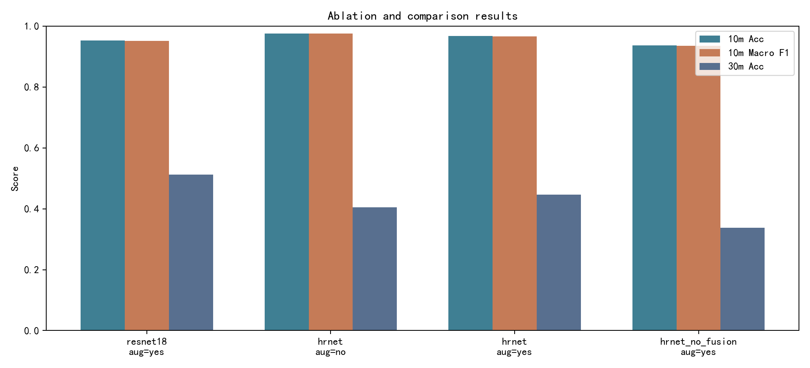

# 题目12 高分辨率遥感图像地物分类：代码与训练结果说明

## 本次完成内容

已完成 EuroSAT 遥感图像地物分类的训练、评估和结果图保存。实现代码位于 `train_eurosat.py`，数据集使用 `data/eurosat/2750`，输出结果位于 `results/eurosat/20260609_134700`。

## 代码说明

- `train_eurosat.py`：主训练脚本，包含数据读取、分层划分、HRNet/ResNet-18模型、训练、测试、绘图和结果说明文档生成。
- `summarize_ablation.py`：消融实验汇总脚本，读取多组 `metrics.json` 并生成表格、Markdown说明和柱状图。
- `test_train_eurosat.py`：基础测试，验证数据发现、分层划分和模拟分辨率变换。
- `results/eurosat/20260609_134700/best_model.pth`：验证集准确率最高的模型权重。
- `results/eurosat/20260609_134700/metrics.json`：训练历史、测试指标、混淆矩阵和输出文件路径。
- `results/eurosat/20260609_134700/work_summary.md`：本次实验的图像说明文档，可直接作为报告素材参考。

## 训练配置

- 模型：HRNet风格多分辨率分类网络。由于当前 EuroSAT 数据是整图类别标签而不是像素级分割标注，因此采用 HRNet 分类结构；DeepLabV3+更适合有像素级标签的语义分割任务。
- 数据划分：训练集18900张，验证集4050张，测试集4050张。
- Epochs：20
- Batch size：128
- Learning rate：0.001
- Optimizer：AdamW
- Loss：CrossEntropyLoss
- 设备：NVIDIA GeForce RTX 3070 Laptop GPU

## 实验结果

- 10m原始输入测试集 Accuracy：0.9672
- 10m原始输入测试集 Macro F1：0.9663
- 30m模拟输入测试集 Accuracy：0.4459
- 30m模拟输入测试集 Macro F1：0.3928

30m模拟方式为先将64x64图像下采样到约1/3尺寸，再放大回64x64，用于近似观察空间分辨率下降对分类性能的影响。

## 对比实验与消融实验

所有实验使用相同的数据划分、随机种子、优化器和20个epoch训练设置。ResNet-18用于模型架构对比；HRNet无数据增强用于验证随机翻转、旋转、颜色扰动的作用；HRNet无多分辨率融合用于验证HRNet风格结构中的高、中、低分辨率特征融合是否有效。

| 实验 | 模型 | 数据增强 | Epoch | 最佳验证Acc | 10m测试Acc | 10m Macro F1 | 30m测试Acc | 30m Macro F1 |
| --- | --- | --- | --- | --- | --- | --- | --- | --- |
| 基线对比 | resnet18 | yes | 20 | 0.9573 | 0.9528 | 0.9514 | 0.5121 | 0.4640 |
| 消融：无增强 | hrnet | no | 20 | 0.9726 | 0.9756 | 0.9752 | 0.4044 | 0.3384 |
| 主模型 | hrnet | yes | 20 | 0.9728 | 0.9672 | 0.9663 | 0.4459 | 0.3928 |
| 消融：无多分辨率融合 | hrnet_no_fusion | yes | 20 | 0.9338 | 0.9368 | 0.9350 | 0.3373 | 0.2419 |

结论：HRNet主模型在10m测试集上比ResNet-18基线高0.0144，说明多分辨率特征结构对EuroSAT地物分类有效。无多分辨率融合模型下降到0.9368，比主模型低0.0304，进一步说明融合模块是有效贡献。无增强HRNet在10m同分布测试上最高，但30m模拟输入低于开启增强的HRNet，说明数据增强更有利于分辨率变化场景下的鲁棒性。ResNet-18在30m模拟输入上最高，说明较强的下采样结构在低分辨率退化输入上具有一定鲁棒性，但其10m原始输入精度低于HRNet。

消融实验完整结果文件位于 `results/eurosat/ablation_summary/ablation_results.md`，CSV文件位于 `results/eurosat/ablation_summary/ablation_results.csv`。

## 可放入报告的图像与描述


图1 类别分布图：展示EuroSAT 10类地物样本数量。可用于“数据准备”部分，说明数据集包含农田、森林、住宅区、水体等类别，各类数量整体较均衡。


图2 训练曲线：展示训练集与验证集的损失、准确率随epoch变化。模型在20个epoch内持续收敛，验证集准确率最高达到0.9728。


图3 归一化混淆矩阵：横轴为预测类别，纵轴为真实类别。对角线越亮表示识别越准确，非对角线可用于分析易混淆类别，例如部分道路、河流、永久作物之间的误判。


图4 样例预测图：展示测试集中若干遥感图像的真实类别、预测类别和置信度。绿色标题表示预测正确，红色标题表示预测错误，可用于报告的定性结果分析。


图5 分辨率对比图：比较原始10m输入与模拟30m输入下的Accuracy和Macro F1。结果显示空间分辨率降低会显著削弱地物纹理和边界信息，从而降低分类性能。



图6 消融实验柱状图：比较ResNet-18、HRNet主模型、HRNet无增强和HRNet无多分辨率融合四组实验的10m测试准确率、10m Macro F1和30m模拟测试准确率。可用于报告的“对比实验”和“消融实验”部分。

## 复现实验

```powershell
conda activate eurosat_env
python train_eurosat.py --epochs 20 --batch-size 128 --num-workers 2 --model hrnet
```

如果 PowerShell 中 `conda activate eurosat_env` 没有切换到正确环境，可使用：

```powershell
conda run -n eurosat_env --no-capture-output python train_eurosat.py --epochs 20 --batch-size 128 --num-workers 2 --model hrnet
```

复现消融汇总：

```powershell
conda run -n eurosat_env --no-capture-output python summarize_ablation.py results/eurosat/20260609_144810 results/eurosat/20260609_134700 results/eurosat/20260609_145941 results/eurosat/20260609_151513
```
