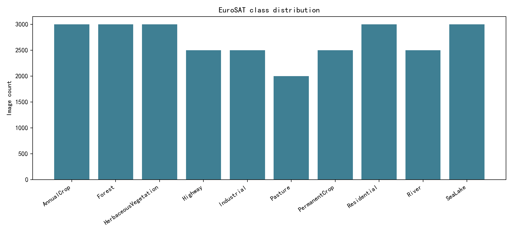
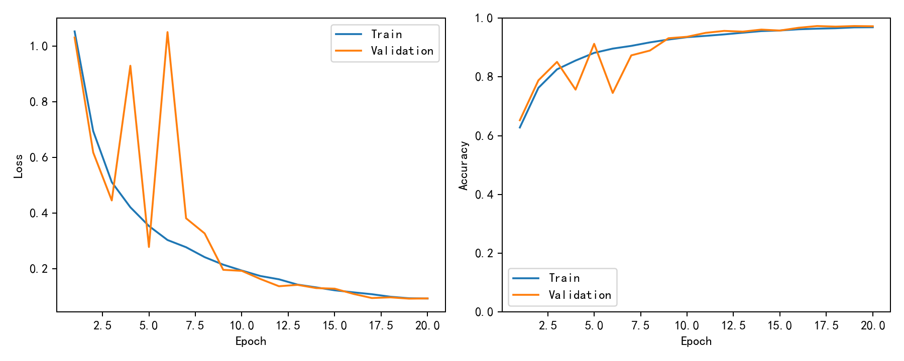
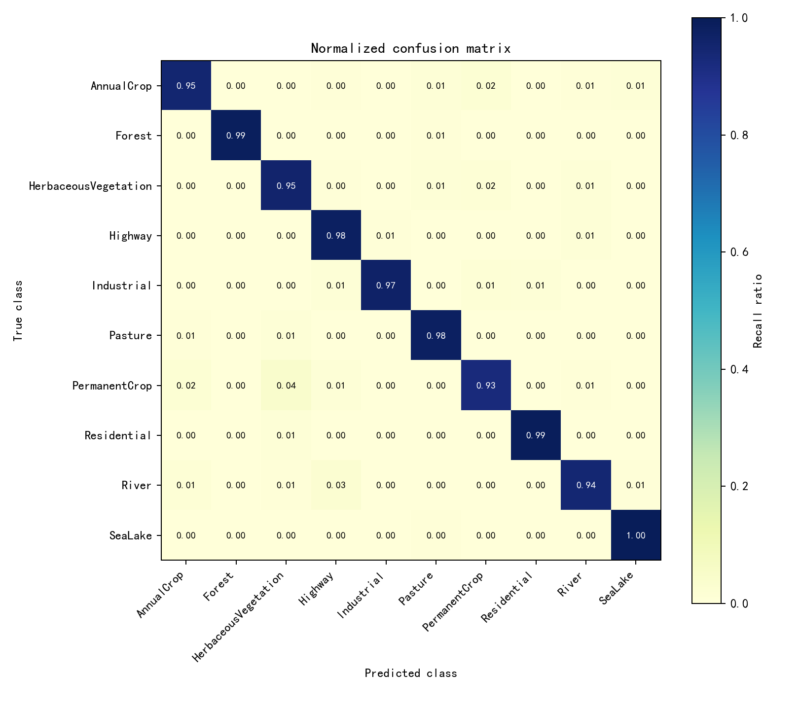
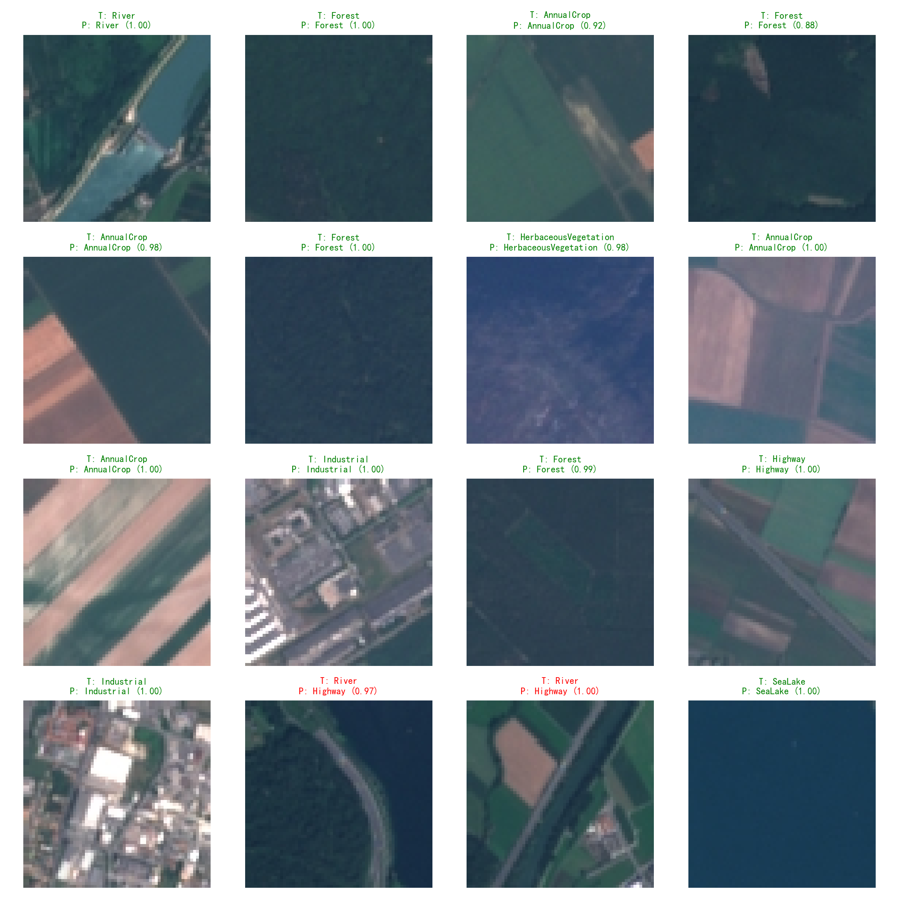
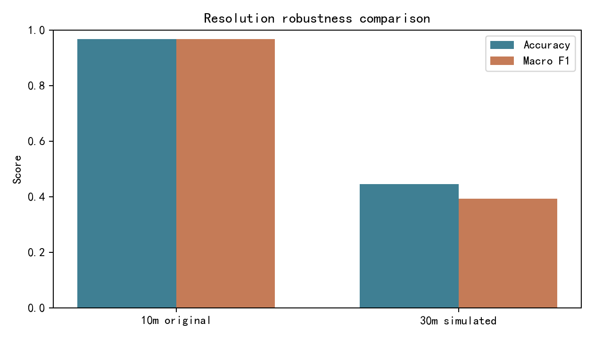

# EuroSAT遥感图像地物分类代码与实验说明

## 工作概述

本次工作完成了题目12“高分辨率遥感图像地物分类”的代码实现、模型训练、评估与结果图保存。数据集使用 `data/eurosat/2750` 下的 EuroSAT RGB 图像，共10类地物，任务形式为整幅遥感图像分类。

## 方法说明

- 数据划分：按类别分层划分训练集、验证集、测试集，默认比例为70%/15%/15%。
- 模型：hrnet分类网络。当前数据集为整图类别标签，因此采用HRNet风格的多分辨率分类结构；DeepLabV3+更适合像素级分割标注。
- 训练策略：交叉熵损失、AdamW优化器、余弦退火学习率调度，并使用随机翻转、旋转和颜色扰动增强训练样本。
- 分辨率对比：保留原始64x64图像作为10m设置；将图像下采样至约1/3后再放大回64x64，模拟30m低分辨率输入。

## 关键超参数

- Epochs: 20
- Batch size: 128
- Learning rate: 0.001
- Image size: 64
- Random seed: 42
- Best validation epoch: 17

## 实验结果

- 10m测试集 Accuracy: 0.9672
- 10m测试集 Macro F1: 0.9663
- 30m模拟测试集 Accuracy: 0.4459
- 30m模拟测试集 Macro F1: 0.3928

## 图像与报告描述



图1 类别分布图：展示EuroSAT 10类地物样本数量。可以用于报告的数据准备部分，说明数据集类别较均衡但各类数量并不完全一致。



图2 训练曲线：展示训练集与验证集的损失、准确率随epoch变化。可以用于说明模型收敛情况和是否存在过拟合。



图3 归一化混淆矩阵：横轴为预测类别，纵轴为真实类别。对角线越亮表示该类别识别越准确，非对角线可用于分析易混淆地物类型。



图4 样例预测图：展示测试集中若干遥感图像的真实类别、预测类别和置信度。绿色标题表示预测正确，红色标题表示预测错误。



图5 分辨率对比图：比较原始10m输入与模拟30m输入下的Accuracy和Macro F1，用于报告扩展部分讨论空间分辨率降低对分类性能的影响。

## 输出文件

- `best_model.pth`：验证集准确率最高的模型权重。
- `metrics.json`：类别名称、训练历史、10m/30m测试指标。
- `class_distribution.png`、`training_curves.png`、`confusion_matrix.png`、`sample_predictions.png`、`resolution_comparison.png`：可直接放入报告的实验图。

## 运行方式

```powershell
conda activate eurosat_env
python train_eurosat.py --epochs 20 --batch-size 128 --model hrnet
```